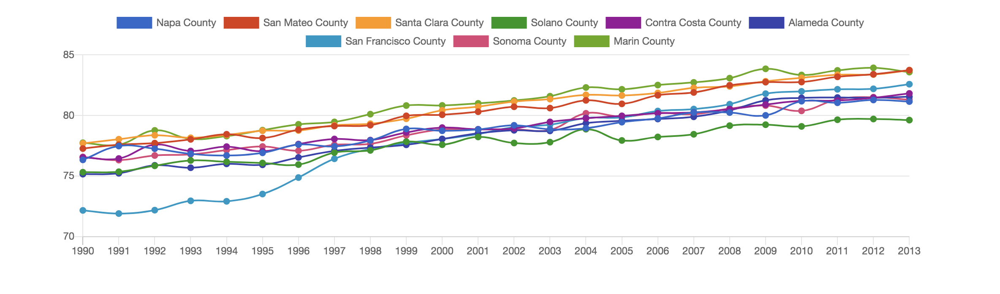

# Vital Signs Life Expectancy



This application visualizes data from the Vital Signs life expectancy data set found [here](https://data.bayareametro.gov/dataset/Vital-Signs-Life-Expectancy-by-county/g26a-g4jw).

## Architecture & dependencies

- [Ruby on Rails](https://rubyonrails.org/) v. 5
- [WATable](https://wootapa-watable.appspot.com/) (Sortable tables)
- [ChartKick](https://chartkick.com/) (Pretty graphs)
- [Rubocop](https://github.com/rubocop-hq/rubocop) (Linter)
- [Rspec](https://github.com/rspec/rspec-rails) (Tests)

## Prerequisites

- [Docker](https://www.docker.com/products/docker-desktop)

## Building the application

You need to build the application before you can run it. This may take a couple minutes, but it only needs to be done once.

```
docker-compose build
```

## Starting & stopping the application

When you've completed the build step above you can start the application with:
```
docker-compose up -d
```

When you're finished clean up the containers with:
```
docker-compose down
```

## Common tasks

Run Rubocop (linter):
```
docker-compose run web rubocop
```

Run tests:
```
docker-compose run web rspec
```

## Code features

- Separation of concerns, with display & logic separated into views, controllers, and gateways for external API access
- Vital Signs API integration with configurable API token
- Sortable, filterable data table via WATable
- Configurable line chart to make sense of the data via ChartKick
- Minimal CSS
- Configuration values stored together in convenient yaml format
- Linting via Rubocop
- Tests via Rspec

## Where to start

Rails apps comes with a lot of cruft by default. If you want to understand how this app works check out these files:

- `app/controllers/life_expectancy_controller.rb`
- `app/gateways/vital_signs_gateway.rb`
- `app/views/life_expectancy/index.html.erb`
- `app/assets/stylesheets/application.scss`
- `config/routes/rb`
- `config/settings.yml`

## To do

I cut some corners because this is a demo app. Here are some potential enhancements:

  - Don't store the API app token in the repo
  - Error handling on API responses
  - More tests
  - Move Javascript 3rd-party library config out of `.html.erb` files
  - Remove all the unused rails code & dependencies that come by default